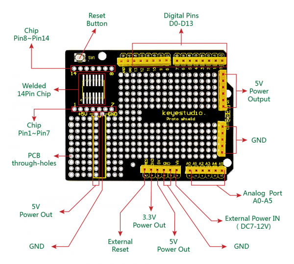
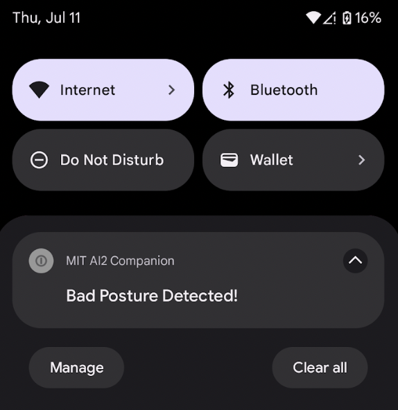
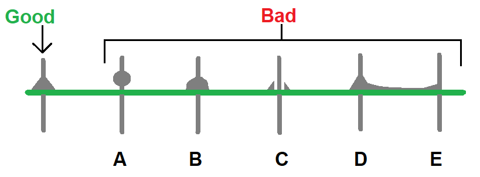
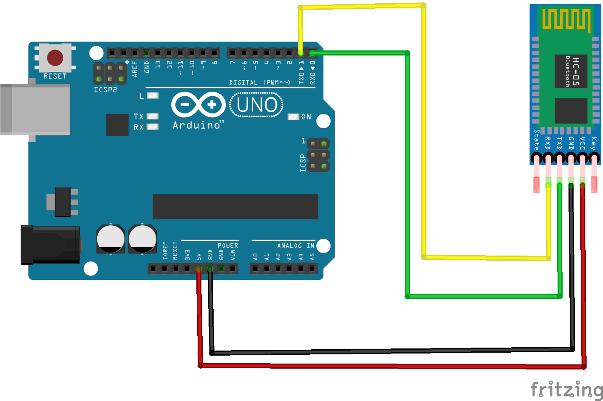
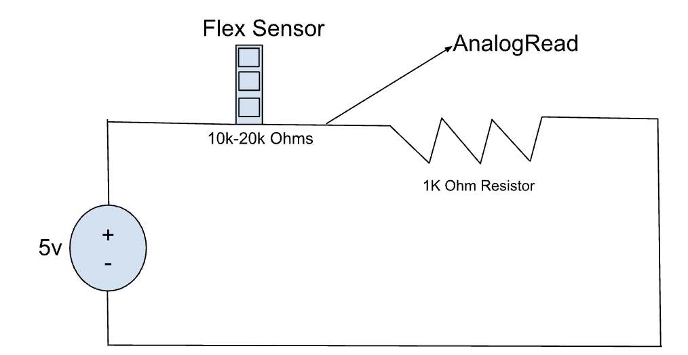
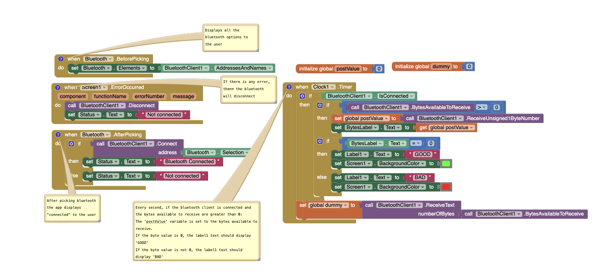

# Posture Corrector
My main project is a posture corrector that notifies the user on the mobile phone if they are sitting in a bad posture. The original concept was that the user would sit on a deflated yoga ball with a flex sensor that tracks if they are slouching or in a bad posture based on the pressure the user exerts on the sensor. I modified this by attaching all of my components onto a jacket to make the posture corrector portable. If the user slouches, the LED strip will light up and the user will also get a phone notification to fix their posture. 

<!--- Replace this text with a brief description (2-3 sentences) of your project. This description should draw the reader in and make them interested in what you've built. You can include what the biggest challenges, takeaways, and triumphs from completing the project were. As you complete your portfolio, remember your audience is less familiar than you are with all that your project entails! --> 

| **Engineer** | **School** | **Area of Interest** | **Grade** |
|:--:|:--:|:--:|:--:|
| Vihaan D | Irvington High School | Mechanical Engineering | Incoming Sophomore

<!---  -->
 

# Modifications
<iframe width="560" height="315" src="https://www.youtube.com/embed/z_qOEBJw7Ik?si=lPily4dbbrE8WJUR" title="YouTube video player" frameborder="0" allow="accelerometer; autoplay; clipboard-write; encrypted-media; gyroscope; picture-in-picture; web-share" referrerpolicy="strict-origin-when-cross-origin" allowfullscreen></iframe>

## Summary
For modifications, I made the posture corrector portable and I attached all of my components onto a jacket I bought from home. I taped the flex sensor onto the jacket and I sewed on the Arduino and a pouch for the battery using fabric. Lastly, I used the adhesive on the back of LED lights to stick them onto the jacket. When I plug the battery into the Arduino, the lights turn on and the app displays the user's posture status as well. 

 

**Figure 1**
This diagram depicts what happens if the user is standing straight versus if they are slouching. 

## Challenges Faced
One of the biggest challenges that I faced while working on this project was sewing my Arduino onto the jacket. I had never sewed before, so I had to learn how to sew using several YouTube videos. Even after this, when I sewed my Arduino to the jacket, the strings kept on snapping when I lifted the jacket up due to the weight of the Arduino. As a result, I had to resew the Arduino several times onto the jacket to make sure that it was sturdy and wouldn't fall out when I wore the jacket. 
  
# Final Milestone
<iframe width="560" height="315" src="https://www.youtube.com/embed/KMdjlEfUCmo?si=qPSNrd0Y0l9mP5I-&amp;start=0&amp;end=82;" title="YouTube video player" frameborder="0" allow="accelerometer; autoplay; clipboard-write; encrypted-media; gyroscope; picture-in-picture; web-share" referrerpolicy="strict-origin-when-cross-origin" allowfullscreen></iframe>
## Summary
For my final milestone, I added notifications to my app if the user's posture is bad. To accomplish this, I first downloaded a notification extension on MIT App Inventor called ‘NotificationStyle1’. Then, I added code that displays the notification "Bad Posture Detected" on the user's phone if it detects bad posture. Additionally, I also soldered all of my components (solid wires, a resistor, HC-05 bluetooth module, etc) to a protoshield from a breadboard to make my project portable. 

 

**Figure 1**
I used a prototyping shield for my Arduino that provides a layout with various components labeled for easy identification. This prototyping shield is designed to expand the functionality of an Arduino board by offering additional connections and soldering space. There are also ready-made traces connecting different through holes for easier and more efficient connections. In order to connect the proto shield to the Arduino, I soldered header pins on it which connect to the following pins on the Arduino. 

If the user bends or slouches, the flex sensor will read this data and they will get a notification on their phone which you can see below:

 

**Figure 2**
After the user connects to the bluetooth, they will get to see their posture status. If they choose toggle’s the notification switch on and their posture is “bad”, they will also get a notification on their phone telling them to fix their posture. This way even if they don’t have their app open, they will still get to know if their posture is bad. 

## Challenges Faced
I faced several challenges while working on my final milestone. One of the challenges I faced while working on my project was soldering all of my components onto the proto shield from a breadboard. Initially, on my first attempt, I misaligned the header pins when soldering, so the proto shield wasn't able to connect to the arduino. As a result, I had to try again with a new proto shield. I learned to use masking tape this time so that the header pins wouldn't fall out or move around. On my second attempt, I was able to connect the proto shield onto the Arduino Uno. 

 

**Figure 3**
Another challenge I faced was that the circuit wasn't working and the flex sensor values were extremely inconsistent even though I soldered all the wires onto the proto shield. As you can see on the diagram above, my soldering looked like the examples on the right side. I was either putting too little solder, too much solder, or was accidentally bridging two holes together. I realized that the soldering iron I used didn’t have a pointy tip and wasn’t getting that hot. As a result, I switched to a better soldering iron, and I eventually got the circuit to work successfully. 


# Second Milestone
<iframe width="560" height="315" src="https://www.youtube.com/embed/ug6znjBkHx4?si=Kiblc67JjN4fv6Nt" title="YouTube video player" frameborder="0" allow="accelerometer; autoplay; clipboard-write; encrypted-media; gyroscope; picture-in-picture; web-share" referrerpolicy="strict-origin-when-cross-origin" allowfullscreen></iframe>

## Summary
For my second milestone, I used bluetooth to connect the arduino to my phone. I then made an app on MIT App Inventor that displays if the user's posture is good or bad on the user interface. The bluetooth module sends data from the arduino to the app wirelessly. In order for the app to update in real time, the data needs to be transmitted from the arduino to the app quickly. To do this, I wrote my code so that it sends one byte at a time in order for the app to update in real time. The 'Serial.write' function sends 1 or 0 in a byte form based on the flex sensor value, then 'Serial.flush', which is the next line in the code, forces that byte to be sent right away. On the MIT app inventor, it reads the byte as either a 0 or 1. The 0 indicates that the user is in a good posture and the 1 indicates that the user is in bad posture.  This allows the data to be received from the phone quickly and accurately.

 

**Figure 4**
The diagram illustrates how to connect an HC-05 Bluetooth module to an Arduino Uno. Specifically, the HC-05's VCC pin connects to the Arduino's 5V pin for power, the GND pin to the Arduino's GND, the TXD (transmit) pin to the Arduino's RX (digital pin 0) for sending data from the HC-05 to the Arduino, and the RXD (receive) pin to the Arduino's TX (digital pin 1) for sending data from the Arduino to the HC-05. This configuration enables Bluetooth communication between the Arduino and other devices.

## Challenges Faced
I faced several challenges while working on my second milestone. One challenge that I had was connecting the app and phone with the bluetooth module. This was a challenging problem because the HC-05 bluetooth module was neither reliable nor consistent. To get the connection working, I had to repair the module to my phone several times and downloaded an app called the Serial Bluetooth Terminal. I also learned what the blinking signals meant on the HC-05 bluetooth module. The module blinks slowly once if you restart it, twice every two seconds if it's paired to something, and constantly blinks if it is in pairing mode. Another challenge that I had was displaying the posture status on my MIT App Inventor app. I resolved this by making a variable called ‘postValue’ that receives the value the byte sends to the app. If it receives “1”, it will display “Posture Status: Good” on the screen and it displays “Posture Status: Bad” if it receives any other value. 

# First Milestone
<iframe width="560" height="315" src="https://www.youtube.com/embed/0MkvHYonFoM?si=55vPkFj9Fgtnr8u4" title="YouTube video player" frameborder="0" allow="accelerometer; autoplay; clipboard-write; encrypted-media; gyroscope; picture-in-picture; web-share" referrerpolicy="strict-origin-when-cross-origin" allowfullscreen></iframe> 

## Summary
My main project is the posture corrector. For my first milestone, I worked on attaching a flex sensor and a LED light strip to a circuit that lights up based on the value of the flex sensor. 

 

**Figure 5** 
To connect the flex sensor to the Arduino, I created a voltage divider circuit with a flex sensor and a fixed resistor. The flex sensor is a type of resistor that changes its resistance based on how much it is bent. Flex sensors are often made of conductive rubbery strips between two metal plates, so when the sensor is unbent, the rubbery strip is thick and solid, so it conducts little current between the plates. On the other hand, when the sensor is bent, the strip spreads out and allows more current to pass through, which is detected and fed back to the system to indicate the amount of flex. One end of the flex sensor is connected to the 5v pin on the Arduino and the point between these two resistors is connected to the analog input pin on the Arduino. Ohm's Law (V = IR) helps calculate the current through the circuit and the voltage of the fixed resistor. It states that the voltage across a conductor is directly proportional to the current flowing through it. As the flex sensor bends, its resistance increases, decreasing the current and, by extension, the voltage at the analogRead pin on the Arduino. This change in voltage, determined by the voltage divider formula (Vout= Vin (R2/R1+R2)) allows the Arduino to measure and read how much the flex sensor is bending.The voltage divider formula describes how the input voltage (Vin) is divided across two resistors in a series (R1 and R2) inorder to produce an output voltage (Vout). Therefore, Vout is a fraction of Vin determined by the ratio of R2 to the total resistance R1+R2. This principle allows for the reduction of a larger voltage to a smaller, controlled voltage. 

Additionally, I added an LED light strip to the arduino. To code the LED light strip, I used the Adafruit NeoPixel library and added a feature that changes the LED strip color depending on the value of the flex sensor. To initiate and update the NeoPixel object, I used object-oriented design to control the LED strip. Object-oriented programming (OOP) is a programming model that organizes software design around data and objects. As compared to structured programming, OOP follows a bottom-up approach which means that it starts with the most basic elements and builds them into larger subsystems, eventually forming a complete system. The four main concepts in OOP are encapsulation (provides security and obfuscates code), abstraction (hides complexity for simplicity), inheritance (uses other template features into a new child template), and polymorphism (when a child template function displays a different behavior). For controlling NeoPixel LED lights using OOP, I included classes to manage the LED light strip. These classes encapsulate the behavior and properties of the LEDs by providing functions to set colors and manage the strips. This approach also uses abstraction as it simplifies the control of LEDs by offering a structured and easy way to handle the LED operations. In my program, the LED strip turns red if the flex sensor bends (outputs a higher value), and it turns green if the flex sensor remains straight (outputs a lower value). This way, when the user sits on the yoga ball that has the flex sensor attached to it, they can see if their posture is good or bad depending on the color the LED strip displays.


 

**Figure 6** 
This image shows a basic circuit setup with an Arduino Uno and a strip of WS2812B LEDs. Three wires connect the Arduino to the LED strip:
1. The black wire goes from the GND pin on the Arduino to the GND pin on the LED strip.
2. The pink wire goes from the 5V pin on the Arduino to the 5V pin on the LED strip.
3. The orange wire goes from digital pin 6 on the Arduino to the data input (DIN) pin on the LED strip.

This setup allows the Arduino to control the LEDs, changing their colors and brightness. The Arduino gets power through the USB cable, which also allows programs to be uploaded to it with a computer.

## Challenges Faced
One challenge I faced while working on my first milestone was coding the LED strip. While I was coding the light strip to change colors depending on the value of the flex sensor, I faced several errors in the Arduino IDE. It took a lot of time and effort to debug my code and find the errors, but eventually I was able to get it working and the LED lights worked the way I wanted them to. Another challenge I faced was getting the flex sensor to be consistent. The values the flex sensor was outputting onto the Serial Monitor kept changing and it wasn't making much sense. I found an error in my code, and was able to correct it. Now, when the flex sensor is straight the value outputted onto the Serial Monitor stays above 100. On the other hand, when the flex sensor bends, the value outputted onto the Serial Monitor stays below 100.  

<!--- For your first milestone, describe what your project is and how you plan to build it. You can include:

- An explanation about the different components of your project and how they will all integrate together
- Technical progress you've made so far
- Challenges you're facing and solving in your future milestones
- What your plan is to complete your project -->

# Schematics 
### Flex Sensor with LED Lights: 
 

This schematic illustrates a circuit involving an Arduino Uno, a flex sensor, and a strip of NeoPixel LEDs. The flex sensor is connected to a breadboard, with one pin connected to the Arduino's 5V pin and another to an analog input pin (A0) through a resistor. The NeoPixel strip is connected to a digital output pin on the Arduino, with additional connections for power (5V) and ground (GND). This setup allows the Arduino to read the flex sensor's input and control the NeoPixel LEDs based on how much the flex sensor bends. 

<!--- Here's where you'll put images of your schematics. [Tinkercad](https://www.tinkercad.com/blog/official-guide-to-tinkercad-circuits) and [Fritzing](https://fritzing.org/learning/) are both great resoruces to create professional schematic diagrams, though BSE recommends Tinkercad becuase it can be done easily and for free in the browser. -->


# Code
<!--- Here's where you'll put your code. The syntax below places it into a block of code. Follow the guide [here]([url](https://www.markdownguide.org/extended-syntax/)) to learn how to customize it to your project needs. -->

```c++
#include <Adafruit_NeoPixel.h>
#include <SoftwareSerial.h>

#define LED_PIN    6
#define LED_COUNT  60
#define FLEX_PIN   A0
#define BT_RX      10
#define BT_TX      11

Adafruit_NeoPixel strip = Adafruit_NeoPixel(LED_COUNT, LED_PIN, NEO_GRB + NEO_KHZ800);
SoftwareSerial BTSerial(BT_RX, BT_TX);

void setup() {
  strip.begin();
  strip.show();
  Serial.begin(9600);
  BTSerial.begin(9600);
}

void loop() {
  int flexValue = analogRead(FLEX_PIN);
  byte send = 0;
  Serial.print("Sensor: ");
  Serial.println(flexValue);

  if (flexValue > 100) {
    setStripColor(strip.Color(0, 255, 0)); // Green if flex sensor value >100
    BTSerial.write(send);
    BTSerial.flush();  // Send "Bad" over Bluetooth
    Serial.print("0");
    Serial.println("0");
  } else {
    setStripColor(strip.Color(255, 0, 0)); // Red if flex sensor value <=100
    send = 1;
    BTSerial.write(send);
    BTSerial.flush(); // Send "Good" over Bluetooth
    Serial.print("1");
    Serial.println("1"); 
  }

  delay(1000);
}

void setStripColor(uint32_t color) {
  for (int i = 0; i < strip.numPixels(); i++) {
    strip.setPixelColor(i, color);
  }
  strip.show();
}
```
 


# Bill of Materials
<!--- Here's where you'll list the parts in your project. To add more rows, just copy and paste the example rows below.
Don't forget to place the link of where to buy each component inside the quotation marks in the corresponding row after href =. Follow the guide [here]([url](https://www.markdownguide.org/extended-syntax/)) to learn how to customize this to your project needs. -->

| **Part** | **Note** | **Price** | **Link** |
|:--:|:--:|:--:|:--:|
| Arduino Uno | Open source microcontroller used to read inputs | $28.50 | <a href="https://www.amazon.com/Arduino-A000066-ARDUINO-UNO-R3/dp/B008GRTSV6/"> Link </a> |
| Breadboard | Used to build circuts | $5.99 | <a href="https://www.amazon.com/Qunqi-point-Experiment-Breadboard-5-5%C3%978-2%C3%970-85cm/dp/B0135IQ0ZC/ref=sr_1_10?crid=2NREO3D61OYUY&keywords=breadboard&qid=1687992200&sprefix=breadboar%2Caps%2C210&sr=8-10"> Link </a> |
| LED Light Strip | Used to alert the user that they are in bad posture | $19.99 | <a href="https://www.amazon.com/LOAMLIN-WS2812B-Individually-Addressable-Waterproof/dp/B0956C7KFR/ref=sr_1_6?dib=eyJ2IjoiMSJ9.YGiq2unF9yG8s7K26jsiuiT_CTifLDDTHnOBE1CAT0Iy5_9z_ZC_gjCuf_q-k7rj8xAoPsC4YwdkL2CXobTxyoLCgJmTn3wnitm1uAEfCay5QrE5rXG0Ik4dgSECr0Mad21fhj-x0NK39sJgwTzi_14Ip611KGw01PakF6xNDmRsu3pIV1ihVhElsnUGoP8AAJQz62korHE9WCxoZ3kouaKYWdvBARpUzaghGHDR5IqZoRWstQiuuWnmuaajF9nl3wNXLPqJPwa5EaTZokeCYDqc3pNA3yjIrs6vUZmV6-A.eMgvWP9bGK2pOYvPx2rGwxGjUytEyj2KQGDL1Wx6Rz0&dib_tag=se&keywords=WS2812B%2Bled%2Blight%2Bstrip&qid=1719864023&sr=8-6&th=1"> Link </a> | 
| Yoga Ball | The user sits on this yoga ball	 | $24.95 | <a href="https://www.amazon.com/OPTP-Soft-Movement-Ball-Stability/dp/B07HZ1ZF2M/ref=sr_1_6?crid=2Z3VMANLO7K39&keywords=pilates+yoga+ball+12+inches&qid=1687561381&sprefix=pilates+yoga+ball+12+inche%2Caps%2C146&sr=8-6"> Link </a> | 
| Jumper Wires | Connection source from arduino to breadboard	 | $1.95 | <a href="https://www.adafruit.com/product/1950"> Link </a> | 
| Long Flex Sensor | Sensor used to measure the resistance of the user | $1.95 | <a href="https://www.adafruit.com/product/182"> Link </a> | 
| 10K Ohms Resistor |Used to generate values for the flex sensor | $0.75 | <a href="https://www.adafruit.com/product/2784"> Link </a> | 
| Android | Used to control the app and receive notifications | $159.99 | <a href="https://www.amazon.com/dp/B09MZBTMQQ/ref=twister_B0BTCN5QXV?_encoding=UTF8&psc=1"> Link </a> | 
| Bluetooth Terminal | Used to send data wirelessly to app | $9.99 | <a href="https://www.amazon.com/DSD-TECH-HC-05-Pass-through-Communication/dp/B01G9KSAF6/ref=sr_1_3?crid=1YJUU51AP8LFK&keywords=hc05+bluetooth+module+for+arduino&qid=1688745485&sprefix=HC05+blueetoo%2Caps%2C158&sr=8-3"> Link </a> | 
| Jacket | Used for my modification where I attached all my components to it | $18.50 | <a href="https://www.ebay.com/itm/385518716838"> Link </a> |
| Water Block Tape | Strong tape used for attaching flex sensor to jacket | $4.29 | <a href="https://www.amazon.com/Band-Aid-Tape-WP-Count/dp/B01MDT6OSK?source=ps-sl-shoppingads-lpcontext&ref_=fplfs&psc=1&smid=ATVPDKIKX0DER"> Link </a> |  

# Starter Project: Retro Arcade Console
<iframe width="560" height="315" src="https://www.youtube.com/embed/3RREYq2UIQs?si=D5jkpsL6lmQbcA0u" title="YouTube video player" frameborder="0" allow="accelerometer; autoplay; clipboard-write; encrypted-media; gyroscope; picture-in-picture; web-share" referrerpolicy="strict-origin-when-cross-origin" allowfullscreen></iframe> 

## Summary: 
I chose to make a Retro Arcade Console as my starter project. This project makes use of a variety of different components which all work together so that the user can play five fun games. I soldered all the components together on the circuit board and then finally connected the battery wire to the circuit board. There are directional buttons, a start button, a stop button, and an on/off button. The button the user presses gets inputted into the sytem and gets outputted onto the LED screen in the form of an aracde game. 

## Components Used:
- Buzzer
- Electric capacitor
- Micro USB
- Power cable
- Self-switch
- Self-switch cap
- Digitron display
- IC chip
- LED dot matrix module
- Button
- Button cap
- PCB
- M3x5mm Screw
- M3x8mm Screw
- Double-pass M3x9 cm Copper column
- Single-head 5+6mm Hexagonal column
- Battery case
- Acrylic shell
  
The digitron display or the 7-segement display is used on my Retro Arcade Console as a score board. What's cool about this component is that only seven segments are needed to make all numbers from 0-9. With the help of the scoreboard, the user knows their score when playing a game. Additionally, the game even saves the user's high score so whenever the user goes back to the game they want to play, they can see what their high score is. Another major component in my Retro Arcade Console is the battery case. This is cruicial so that the user can play on the console whenever and wherever they want. The batteries provide power to the console and are essential in order for all of the components to work. 


**Figure 7**
The diagram depicts a basic LED circuit with a battery, a switch, a resistor, and an LED. The battery provides power, the switch controls the circuit's open or closed state, the resistor limits current to protect the LED, and the LED emits light when the circuit is closed. When the switch is open, the circuit is incomplete and the LED is off. Closing the switch completes the circuit, allowing current to flow and the LED to light up. The resistor ensures the LED receives a safe amount of current. On my starter project, when a button is pressed, the LED board lights up in the same manner.  

## Challenges Faced:
I did encounter several challenges while making this project. For example, on the second day, I had trouble soldering some of the holes in my circuit board. I put the score board in, but as I was soldereding, the score board fell out. As a result, I had 4 holes that were soldered with nothing in the holes. This led to a frustrating hour trying to desolder this. Eventually, I managed to get most of the saughter out with saugher wick and I was able to reinsert the score board in. After this, I learned to tape the components on the circuit board so that they wouldn't fall out. Not only did this make soldering my other components in the circuit board much easier, but it also made soldering a lot faster and efficient.  

# Works Cited 

Figure 1 (Protoshield for Arduino Diagram): <a href="https://wiki.keyestudio.com/Ks0003_keyestudio_Protoshield_for_Arduino_with_Mini_Breadboard/"> Link </a> 

Figure 3 (Good vs Bad Soldering): <a href="https://www.digikey.com/en/maker/projects/another-teaching-moment-through-hole-soldering-basics/be3bd0a005bd4df9927609d4ff4a7ab6"> Link </a> 

Figure 4 (HC-05 Bluetooth Module and Arduino Uno Schematic): <a href="https://forum.arduino.cc/t/arduino-leonardo-and-hc-05-bluetooth-module/1123060"> Link </a> 


<!--# Other Resources/Examples
One of the best parts about Github is that you can view how other people set up their own work. Here are some past BSE portfolios that are awesome examples. You can view how they set up their portfolio, and you can view their index.md files to understand how they implemented different portfolio components.
- [Example 1](https://trashytuber.github.io/YimingJiaBlueStamp/)
- [Example 2](https://sviatil0.github.io/Sviatoslav_BSE/)
- [Example 3](https://arneshkumar.github.io/arneshbluestamp/)

To watch the BSE tutorial on how to create a portfolio, click here. -->
