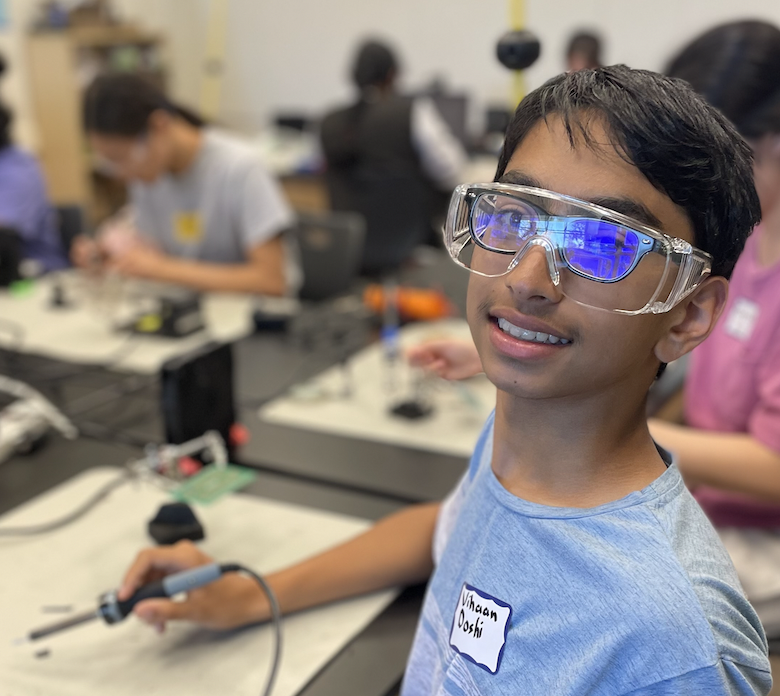
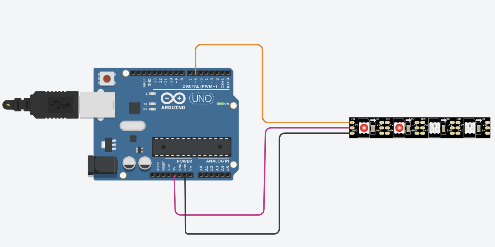
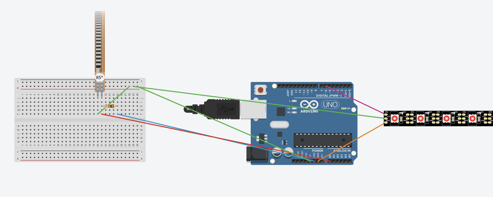
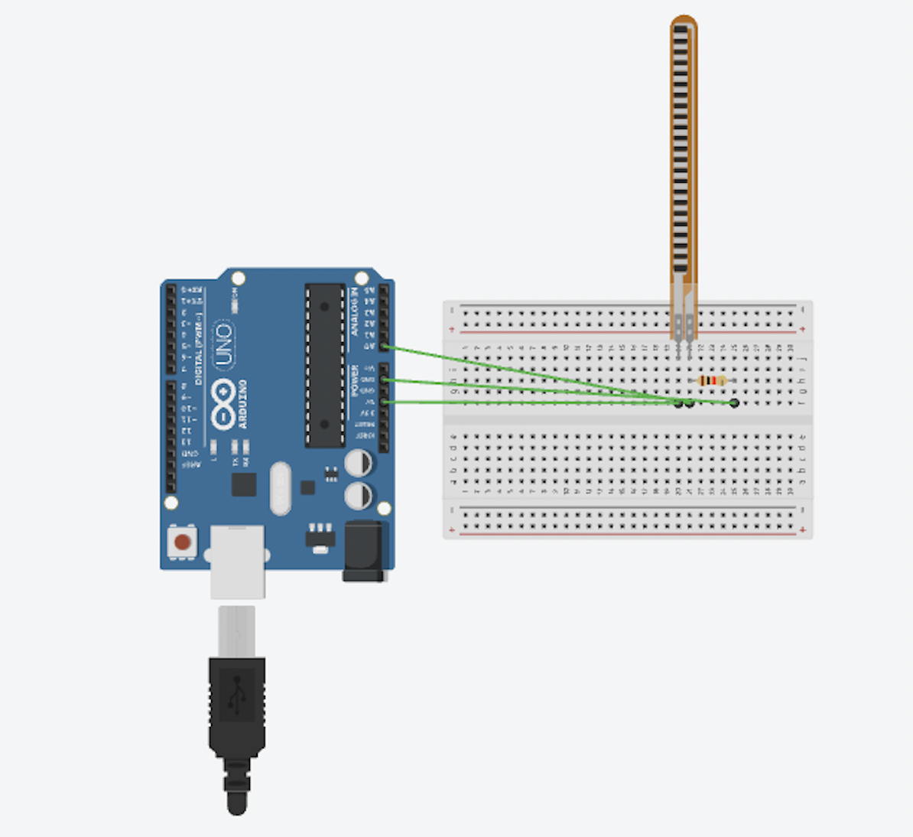
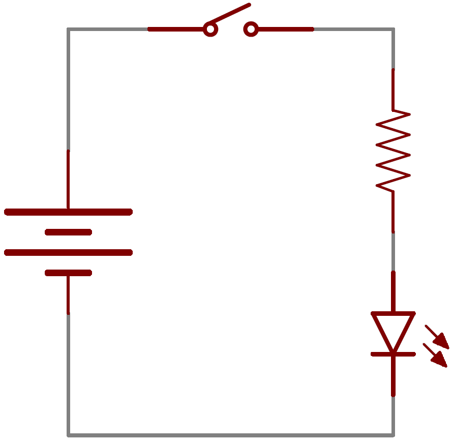

# Posture Corrector
My main project is a posture corrector that notifies the user if they are sitting in a bad posture. The user will sit on a deflated yoga ball with a flex sensor that tracks if they are slouching or in a bad posture based on the pressure the user exerts on the sensor. If the user applies a lot of pressure on the sensor, the LED strip will light up the user will also get a phone notification to fix their posture. 

<!--- Replace this text with a brief description (2-3 sentences) of your project. This description should draw the reader in and make them interested in what you've built. You can include what the biggest challenges, takeaways, and triumphs from completing the project were. As you complete your portfolio, remember your audience is less familiar than you are with all that your project entails! --> 

| **Engineer** | **School** | **Area of Interest** | **Grade** |
|:--:|:--:|:--:|:--:|
| Vihaan D | Irvington High Schoool | Mechanical Engineering | Incoming Sophomore

<!---  -->
 
  
<!--- # Final Milestone

For your final milestone, explain the outcome of your project. Key details to include are:
- What you've accomplished since your previous milestone
- What your biggest challenges and triumphs were at BSE
- A summary of key topics you learned about
- What you hope to learn in the future after everything you've learned at BSE


# Second Milestone

For your second milestone, explain what you've worked on since your previous milestone. You can highlight:
- Technical details of what you've accomplished and how they contribute to the final goal
- What has been surprising about the project so far
- Previous challenges you faced that you overcame
- What needs to be completed before your final milestone -->

# First Milestone
<iframe width="560" height="315" src="https://www.youtube.com/embed/0MkvHYonFoM?si=55vPkFj9Fgtnr8u4" title="YouTube video player" frameborder="0" allow="accelerometer; autoplay; clipboard-write; encrypted-media; gyroscope; picture-in-picture; web-share" referrerpolicy="strict-origin-when-cross-origin" allowfullscreen></iframe> 

## Summary
My main project is the posture corrector. This project consists mainly of a flex sensor and LED light strip. I connected the flex sensor to the breadboard and used three jumper wires that connect to an analog pin, ground pin, and a digital pin on the arduino to complete the circuit. Additionally, I created code using the Arduino IDE that reads the value of the flex sensor and outputs it on my computer. Afterwards, I added an LED light strip to the arduino. To code the LED light strip, I used the Adafruit NeoPixel library and added a feature that changes the LED strip color depending on the value of the flex sensor. The LED strip turns red if the flex sensor bends (outputs a higher value), and it turns green if the flex sensor remains straight (outputs a lower value). This way, when the user sits on the yoga ball that has the flex sensor attached to it, they can see if their posture is good or bad depending on the color the LED strip displays.

## Diagram
 

**Figure 2** 
This image shows a basic circuit setup with an Arduino Uno and a strip of WS2812B LEDs. Three wires connect the Arduino to the LED strip:
1. The black wire goes from the GND pin on the Arduino to the GND pin on the LED strip.
2. The pink wire goes from the 5V pin on the Arduino to the 5V pin on the LED strip.
3. The orange wire goes from digital pin 6 on the Arduino to the data input (DIN) pin on the LED strip.

This setup allows the Arduino to control the LEDs, changing their colors and brightness. The Arduino gets power through the USB cable, which also allows programs to be uploaded to it with a computer.

## Challenges Faced
One challenge I faced while working on my first milestone was coding the LED strip. While I was coding the light strip to change colors depending on the value of the flex sensor, I faced several errors in the Arduino IDE. It took a lot of time and effort to debug my code and find the errors, but eventually I was able to get it working and the LED lights worked the way I wanted them to. Another challenge I faced was getting the flex sensor to be consistent. The values the flex sensor was outputting onto the Serial Monitor kept changing and it wasn't making much sense. I found an error in my code, and was able to correct it. Now, when the flex sensor is straight the value outputted onto the Serial Monitor stays above 100. On the other hand, when the flex sensor bends, the value outputted onto the Serial Monitor stays below 100.  

<!--- For your first milestone, describe what your project is and how you plan to build it. You can include:

- An explanation about the different components of your project and how they will all integrate together
- Technical progress you've made so far
- Challenges you're facing and solving in your future milestones
- What your plan is to complete your project -->

# Schematics 
### Flex Sensor with LED Lights: 
 

### Flex Sensor: 
 

<!--- Here's where you'll put images of your schematics. [Tinkercad](https://www.tinkercad.com/blog/official-guide-to-tinkercad-circuits) and [Fritzing](https://fritzing.org/learning/) are both great resoruces to create professional schematic diagrams, though BSE recommends Tinkercad becuase it can be done easily and for free in the browser. -->


# Code
<!--- Here's where you'll put your code. The syntax below places it into a block of code. Follow the guide [here]([url](https://www.markdownguide.org/extended-syntax/)) to learn how to customize it to your project needs. -->

```c++
#include <Adafruit_NeoPixel.h>

#define LED_PIN     6      // Pin where the data line is connected
#define LED_COUNT   60     // Number of LEDs in the strip
#define FLEX_PIN    A0     // Analog pin for flex sensor

Adafruit_NeoPixel strip = Adafruit_NeoPixel(LED_COUNT, LED_PIN, NEO_GRB + NEO_KHZ800);

void setup() {
  strip.begin();           // Initialize the strip
  strip.show();            // Turn off all LEDs
  Serial.begin(9600);      // Initialize serial communication for debugging
}

void loop() {
  int flexValue = analogRead(FLEX_PIN);  // Read the flex sensor value
  Serial.print("Sensor: ");               
  Serial.println(flexValue);             // Print the value to the Serial Monitor

  if (flexValue < 100) {
    setStripColor(strip.Color(255, 0, 0)); // Red if flex sensor value <20
  } else {
    setStripColor(strip.Color(0, 255, 0)); // Green if flex sensor value >=20
  }

  delay(1000);  // Small delay to stabilize the readings
}

void setStripColor(uint32_t color) {
  for(int i = 0; i < strip.numPixels(); i++) {
    strip.setPixelColor(i, color);   // Set color of each LED
  }
  strip.show();                      // Update strip to show the color
}
```

<!--- # Bill of Materials
Here's where you'll list the parts in your project. To add more rows, just copy and paste the example rows below.
Don't forget to place the link of where to buy each component inside the quotation marks in the corresponding row after href =. Follow the guide [here]([url](https://www.markdownguide.org/extended-syntax/)) to learn how to customize this to your project needs. 

| **Part** | **Note** | **Price** | **Link** |
|:--:|:--:|:--:|:--:|
| Item Name | What the item is used for | $Price | <a href="https://www.amazon.com/Arduino-A000066-ARDUINO-UNO-R3/dp/B008GRTSV6/"> Link </a> |
| Item Name | What the item is used for | $Price | <a href="https://www.amazon.com/Arduino-A000066-ARDUINO-UNO-R3/dp/B008GRTSV6/"> Link </a> |
| Item Name | What the item is used for | $Price | <a href="https://www.amazon.com/Arduino-A000066-ARDUINO-UNO-R3/dp/B008GRTSV6/"> Link </a> | -->

# Starter Project: Retro Arcade Console
<iframe width="560" height="315" src="https://www.youtube.com/embed/3RREYq2UIQs?si=D5jkpsL6lmQbcA0u" title="YouTube video player" frameborder="0" allow="accelerometer; autoplay; clipboard-write; encrypted-media; gyroscope; picture-in-picture; web-share" referrerpolicy="strict-origin-when-cross-origin" allowfullscreen></iframe> 

## Summary: 
I chose to make a Retro Arcade Console as my starter project. This project makes use of a variety of different components which all work together so that the user can play five fun games. I soldered all the components together on the circuit board and then finally connected the battery wire to the circuit board. There are directional buttons, a start button, a stop button, and an on/off button. The button the user presses gets inputted into the sytem and gets outputted onto the LED screen in the form of an aracde game. 

## Components Used:
- Buzzer
- Electric capacitor
- Micro USB
- Power cable
- Self-switch
- Self-switch cap
- Digitron display
- IC chip
- LED dot matrix module
- Button
- Button cap
- PCB
- M3x5mm Screw
- M3x8mm Screw
- Double-pass M3x9 cm Copper column
- Single-head 5+6mm Hexagonal column
- Battery case
- Acrylic shell
  
The digitron display or the 7-segement display is used on my Retro Arcade Console as a score board. What's cool about this component is that only seven segments are needed to make all numbers from 0-9. With the help of the scoreboard, the user knows their score when playing a game. Additionally, the game even saves the user's high score so whenever the user goes back to the game they want to play, they can see what their high score is. Another major component in my Retro Arcade Console is the battery case. This is cruicial so that the user can play on the console whenever and wherever they want. The batteries provide power to the console and are essential in order for all of the components to work. 



**Figure 1**
The diagram depicts a basic LED circuit with a battery, a switch, a resistor, and an LED. The battery provides power, the switch controls the circuit's open or closed state, the resistor limits current to protect the LED, and the LED emits light when the circuit is closed. When the switch is open, the circuit is incomplete and the LED is off. Closing the switch completes the circuit, allowing current to flow and the LED to light up. The resistor ensures the LED receives a safe amount of current. On my starter project, when a button is pressed, the LED board lights up in the same manner.  

## Challenges Faced:
I did encounter several challenges while making this project. For example, on the second day, I had trouble soldering some of the holes in my circuit board. I put the score board in, but as I was soldereding, the score board fell out. As a result, I had 4 holes that were soldered with nothing in the holes. This led to a frustrating hour trying to desolder this. Eventually, I managed to get most of the saughter out with saugher wick and I was able to reinsert the score board in. After this, I learned to tape the components on the circuit board so that they wouldn't fall out. Not only did this make soldering my other components in the circuit board much easier, but it also made soldering a lot faster and efficient.  

<!--- # Other Resources/Examples
One of the best parts about Github is that you can view how other people set up their own work. Here are some past BSE portfolios that are awesome examples. You can view how they set up their portfolio, and you can view their index.md files to understand how they implemented different portfolio components.
- [Example 1](https://trashytuber.github.io/YimingJiaBlueStamp/)
- [Example 2](https://sviatil0.github.io/Sviatoslav_BSE/)
- [Example 3](https://arneshkumar.github.io/arneshbluestamp/)

To watch the BSE tutorial on how to create a portfolio, click here. -->
